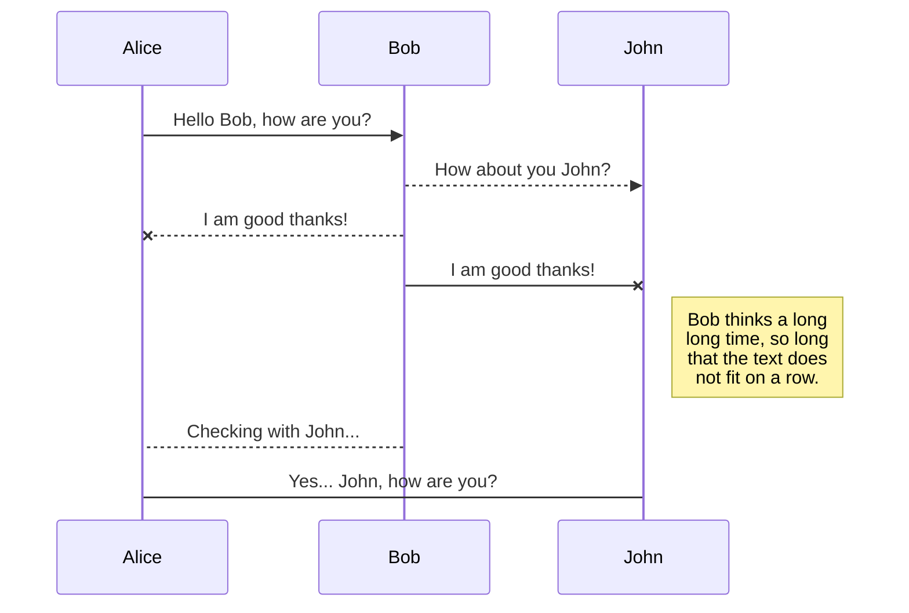
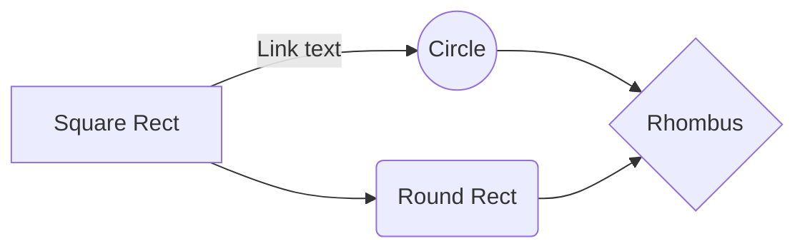

# Alphabot-2-Raspberry-Pi-Code

This is a C++ program to manage an Alphabot 2 using a Raspberry Pi 4.

few months ago I got an AlphaBot 2 (the one that comes with the Raspberry Pi 4).

It was really cool learning how to work with the bot - most samples were written in Python (which is easy to get into).

Some googling told me that it was a good idea to use C or C++ (especially if I know that performance is going to be an issue later on in my coding).

There were very few examples in C or C++, so I set about to make one.

So here's the result of my experimentation. It's a program written in C++ that handles all the bits of hardware that makes up an AlphaBot 2.

### Instructions to get the code compiled: -
1. Install libopencv-dev using the command
  **sudo apt install libopencv-dev**
  
2. copy the external libs to your local lib folder by running
  **./code/DadBot-007/copy-lib-local.sh**

3. load up the project file in **code/DadBot-007/DadBot-007.cbp** using Code::Blocks - and build the **Release** version.
  (I couldn't get the debug version to work - something I'm missing there.)

### You should be able to run the project now - there's quite a bit that the code does - so here's a breakdown: -

## UML diagrams

You can render UML diagrams using [Mermaid](https://mermaidjs.github.io/). For example, this will produce a sequence diagram:

And this will produce a flow chart:

